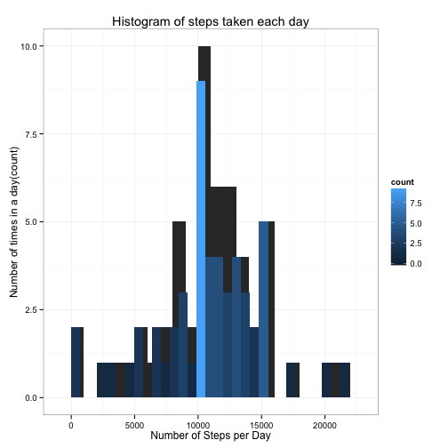

This is an R Markdown document. Markdown is a simple formatting syntax for authoring HTML, PDF, and MS Word documents. For more details on using R Markdown see <http://rmarkdown.rstudio.com>.

## Prepare the R environment


```r
library(knitr)
opts_chunk$set(echo=TRUE, results= 'hold')
```

## Load required libraries


```r
library(data.table)
library(ggplot2)
```

## Load the data


```r
data <- read.table('activity.csv', header=TRUE, sep=",")
```

## Make a histogram of the total number of steps per day


```r
total.steps <- tapply(data$steps, data$date, FUN=sum)
plot1 <- qplot(total.steps,binwidth=1000) + geom_histogram(aes(fill= ..count..)) +
           labs(title="Histogram of steps taken each day",
               x="Number of Steps per Day", y="Number of times in a day(count)") + theme_bw()
print(plot1)
```

```
## stat_bin: binwidth defaulted to range/30. Use 'binwidth = x' to adjust this.
```

 

# Calculate mean and median


```r
mean(total.steps, na.rm=TRUE)
median(total.steps, na.rm=TRUE)
```

```
## [1] 10766
```

```
## [1] 10765
```

## Average daily activity pattern


```r
averages <- aggregate(x=list(steps=data$steps), by=list(interval=data$interval),
                      FUN=mean, na.rm=TRUE)
plot2 <- ggplot(data=averages, aes(x=interval, y=steps)) +
    geom_line(color="blue", size=0.7) +
    xlab("5-minute intervals") +
    ylab("Average number of steps taken")
print(plot2)
```

 

# Which 5 minute interval (all days) contains the most steps?


```r
averages[which.max(averages$steps),]
```

```
##     interval steps
## 104      835 206.2
```

## Imputing missing values


```r
missing <- is.na(data$steps)
```

# How many missing values


```r
table(missing)
```

```
## missing
## FALSE  TRUE 
## 15264  2304
```

# Replace each missing value with the mean value of its 5-minute interval


```r
fill.value <- function(steps, interval) {
    filled <- NA
    if (!is.na(steps))
        filled <- c(steps)
     else
        filled <- (averages[averages$interval==interval, "steps"])
     return(filled)
}
filled.data <- data
filled.data$steps <- mapply(fill.value, filled.data$steps, filled.data$interval)
```

## A histogram of the total number of steps taken each day


```r
total.steps <- tapply(filled.data$steps, filled.data$date, FUN=sum)
plot3 <- qplot(total.steps, binwidth=1000) + geom_histogram(aes(fill=..count..)) +
            labs (title="Histogram of total number of steps taken per day", 
                 x="Number of Steps per Day", y="Number of times in a day(count)") + theme_bw()
                  print(plot3)
```

```
## stat_bin: binwidth defaulted to range/30. Use 'binwidth = x' to adjust this.
```

 

# Report the mean and median total number of steps per day


```r
mean(total.steps)
median(total.steps)
```

```
## [1] 10766
```

```
## [1] 10766
```

## Looking at potential differences in activity patterns between  weekdays and weekends


```r
weekday.or.weekend <- function(date) {
    day <- weekdays(date)
    if (day %in% c("Monday", "Tuesday", "Wednesday", "Thursday", "Friday"))
        return("weekday")
     else if (day %in% c("Saturday", "Sunday"))
         return("weekend")
     else
         stop("invalid date")
}
filled.data$date <- as.Date(filled.data$date)
filled.data$day <- sapply(filled.data$date, FUN=weekday.or.weekend)
```

## Differences in activity patterns between weekdays and weekends


```r
averages <- aggregate(steps ~ interval + day, data=filled.data, mean)
plot4 <- ggplot(averages, aes(x=interval, y=steps)) + 
           geom_line(color="red") + 
             facet_grid(day~ .) +
     xlab("5-minute interval") + ylab("Number of steps")
print(plot4)
```

 


